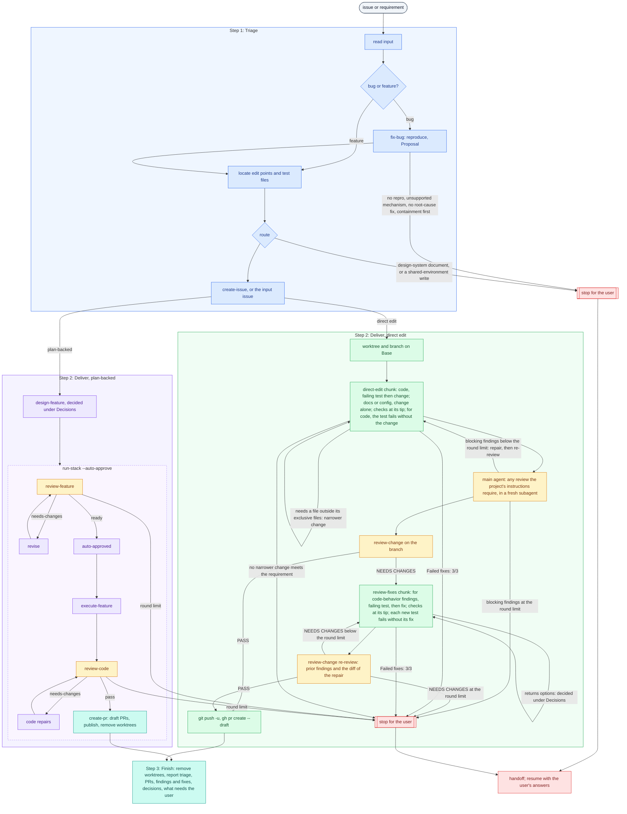

# autopilot flow

Diagram of [autopilot](SKILL.md), which owns the rules.

```mermaid
flowchart TD
  IN([issue or requirement]) --> T1

  subgraph TRIAGE["Step 1: Triage"]
    T1[read input] --> T2{bug or feature?}
    T2 -- bug --> FB["fix-bug: reproduce, Proposal"]
    T2 -- feature --> LOC
    FB --> LOC[locate edit points and test files]
    LOC --> RT{route}
    RT --> ISS["create-issue, or the input issue"]
  end

  FB -- "no repro, unsupported mechanism, no root-cause fix, containment first" --> STOP1[[stop for the user]]
  RT -- "design-system document, or a shared-environment write" --> STOP1

  ISS -- "plan-backed" --> DF
  ISS -- "direct edit" --> WT

  subgraph PLAN["Step 2: Deliver, plan-backed"]
    DF["design-feature, decided under Decisions"] --> RS
    subgraph RS["run-stack --auto-approve"]
      RF[review-feature] -- "needs-changes" --> RV[revise] --> RF
      RF -- ready --> AA[auto-approved] --> EF[execute-feature]
      EF --> RC[review-code]
      RC -- "needs-changes" --> RP[code repairs] --> RC
      RC -- pass --> CP["create-pr: draft PRs, publish, remove worktrees"]
    end
  end

  subgraph DIRECT["Step 2: Deliver, direct edit"]
    WT["worktree and branch on Base"] --> EX["direct-edit chunk: code, failing test then change; docs or config, change alone; checks at its tip; for code, the test fails without the change"]
    EX --> PRV["main agent: any review the project's instructions require, in a fresh subagent"]
    PRV --> RCH["review-change on the branch"]
    RCH -- "NEEDS CHANGES" --> FIX["review-fixes chunk: for code-behavior findings, failing test, then fix; checks at its tip; each new test fails without its fix"]
    FIX --> RRE["review-change re-review: prior findings and the diff of the repair"]
    RRE -- "NEEDS CHANGES below the round limit" --> FIX
    EX -- "reported check failure or missing proof: fix attempt" --> EX
    PRV -- "blocking findings below the round limit: repair, then re-review" --> EX
    PRV -- "blocking findings at the round limit" --> STOP2
    FIX -- "reported check failure or missing proof: fix attempt" --> FIX
    FIX -- "returns options: decided under Decisions" --> FIX
    EX -- "needs a file outside its exclusive files: narrower change" --> EX
    RCH -- PASS --> PUB
    RRE -- PASS --> PUB["git push -u, gh pr create --draft"]
  end

  RF -- "round limit" --> STOP2[[stop for the user]]
  RC -- "round limit" --> STOP2
  RRE -- "NEEDS CHANGES at the round limit" --> STOP2
  EX & FIX -- "Failed fixes: 3/3" --> STOP2
  EX -- "no narrower change meets the requirement" --> STOP2

  CP --> FIN
  PUB --> FIN
  FIN["Step 3: Finish: remove worktrees, report triage, PRs, findings and fixes, decisions, what needs the user"]
  STOP1 & STOP2 --> HO["handoff; resume with the user's answers"]

  classDef triage fill:#dbeafe,stroke:#2563eb,color:#1e3a8a
  classDef plan fill:#ede9fe,stroke:#7c3aed,color:#4c1d95
  classDef direct fill:#dcfce7,stroke:#16a34a,color:#14532d
  classDef review fill:#fef3c7,stroke:#d97706,color:#78350f
  classDef stop fill:#fee2e2,stroke:#dc2626,color:#7f1d1d
  classDef done fill:#ccfbf1,stroke:#0d9488,color:#134e4a
  classDef io fill:#f1f5f9,stroke:#475569,color:#0f172a
  class IN io
  class T1,T2,FB,LOC,RT,ISS triage
  class DF,RV,AA,EF,RP plan
  class WT,EX,FIX,PUB direct
  class RF,RC,PRV,RCH,RRE review
  class STOP1,STOP2,HO stop
  class CP,FIN done
  style TRIAGE fill:#eff6ff,stroke:#2563eb
  style PLAN fill:#f5f3ff,stroke:#7c3aed
  style RS fill:#faf5ff,stroke:#a78bfa,stroke-dasharray:4 3
  style DIRECT fill:#f0fdf4,stroke:#16a34a
```

Colors: blue triage, purple plan-backed, green direct edit, amber review, red stop, teal done.
